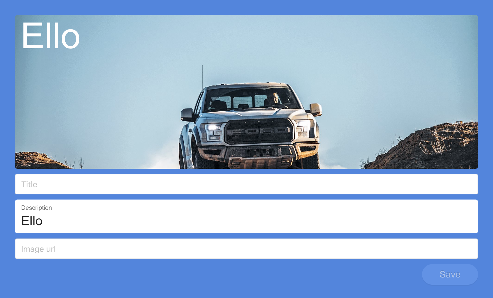

# Fancy post
Fancy post is a modern post editor for your modern React app. Created and maintained by James Star at [Puff Stream](https://www.puffstream.com).

 <!-- .element height="100%" width="100%" -->

Type "hello kitty" into the large entry field and Fancy post `rules` in combination with `schema` will help determine which `FormType` to render, such as, `post`, `weburl` or `image`. After this, fine-tune your form details and click Save.

To get started, read the documentation and guidelines below.

## Motivation
With Facebook, YouTube and more services giving you the power to publish user driven content like posts and videos, this library will help you implement `Fancy post` so your users can get excited about publishing their own content through your app.

## Supported React versions
This package requires React 16.6.0 and higher.

## License
### Commercial license
If you want to use Fancy post to develop commercial sites, themes, projects, and applications, the Commercial license is the appropriate license. With this option, your source code is kept proprietary.

### Open source license
If you are creating an open source application under a license compatible with the GNU GPL license v3, you may use Fancy post under the terms of the GPLv3.

## Quick start
Get a quick start into `Fancy post`
```jsx
git clone git@github.com:puffstream/fancy-post.git
cd fancy-post
npm install
npm start
```

## Usage
To use it, just provide it with a settings configuration object of `schema`, `types`, `rules` and `templates`.

`./src/packages/containers/FancyPost`

```jsx
import FancyPost from './packages/containers/FancyPost';

const settings = typeHereValue => ({
  schema: [
    'post',
  ],
  types: {
    post: {
      fields: ['title', 'description', 'url', 'image']
    },
  },
  rules: {
    post: isPost,
  },
  templates: {
    title: <Input/>,
    description: <TextField value={typeHereValue}/>,
    url: <Input/>,
    image: <Input/>,
  }
});

<FancyPost settings={settings} />
```

## Styles
This library leverages a few different library styles and patterns, such as `Ant Design`, `Material UI`, `SASS` and `BEM (Block Element and Modifier)`.

## Rules
Use `rules` in combination with `schema` and `TypeHere` to help determine which `FormType` will render. If user types, `https://tenor.com/search/kitten-gifs hello kitty`, then the `weburl` `FormType` will be rendered.

## API

### Schema
Create and use schema types, there are 3 out-of-the-box schema types.

| Property | Type | Description |
| ------ | ------ | ------ |
| post | Object | `fields` Object with Array of field types |
| weburl | Object | `fields` Object with Array of field types |
| image | Object | `fields` Object with Array of field types |
| custom | Object | Create your own custom field types |

Code example

```jsx
post: {
  fields: ['title', 'description', 'url', 'image']
}
```

### Components

#### TypeHere
| Property | Type | Description |
| ------ | ------ | ------ |
| preview | Component | Initial text entry, `Hello kitty` |

#### Preview
| Property | Type | Description |
| ------ | ------ | ------ |
| responsiveSize | Object | Set responsive size of preview |

#### FormType
| Property | Type | Description |
| ------ | ------ | ------ |
| settings | Object | Set settings/schema config |
| defaultSchemaType | String | Set default schema type |

By Puff Stream 🚀🐳, 2018
