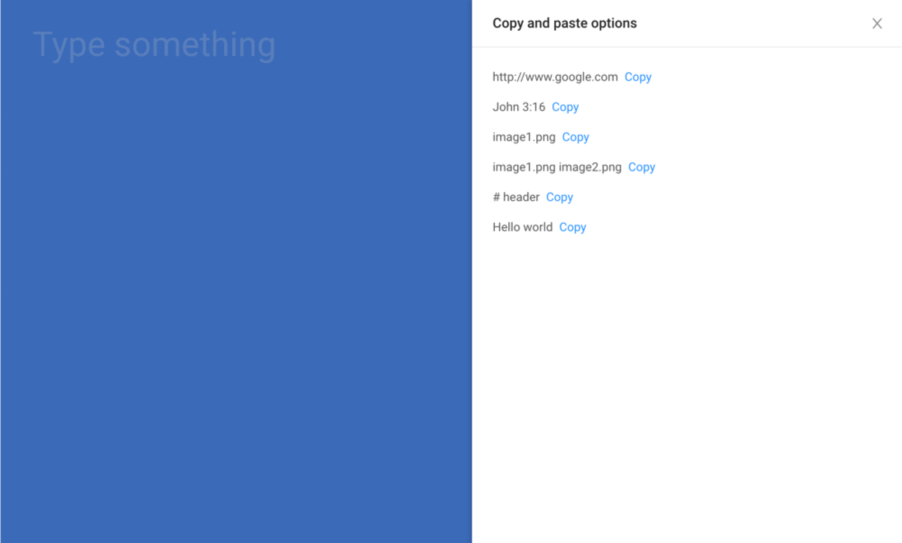

# Fancy post
Fancy post is a modern post editor. Created and maintained by James Star at [Puff Stream](https://www.puffstream.com).

 <!-- .element height="100%" width="100%" -->

Type "hello kitty" and Fancy post will return the most suitable form for your post entry, such as, `Post`, `Web url` or `Image`. 

To get started, read the documentation and guidelines below.

## Motivation
With Facebook, YouTube and WordPress giving you the power to publish your own content, this library will help you implement a front-end UI, that can be hooked into a variety of backend solutions, like Firebase.

## Supported React versions
This package requires React 16.6.0 and higher.

## License
### Commercial license
If you want to use Fancy post to develop commercial sites, themes, projects, and applications, the Commercial license is the appropriate license. With this option, your source code is kept proprietary. Purchase an Fancy post Commercial License at [Gumroad](https://gumroad.com/l/fancypost).

### Open source license
If you are creating an open source application under a license compatible with the GNU GPL license v3, you may use Fancy post under the terms of the GPLv3.

## Quick start
Get a quick start into `Fancy post`

```jsx
git clone git@github.com:puffstream/fancy-post.git
cd fancy-post
npm install
npm start
```

## Usage
To use it, import `FancyPost` and set `formTemplate` prop.

`./src/index`

```jsx
import FancyPost from './packages/containers/FancyPost';
import * as formProps from './packages/forms/formTemplate';
import AddOptions from './packages/forms/helpers/AddOptions';

<FancyPost
  previewAddons={formProps.previewAddons}
  formTemplate={formProps.formTemplate}
  addOptions={AddOptions}
/>
```

You can optionally customise `./templates`.

`./src/packages/forms/utils/templates`

```jsx
const postTempate = typeHereValue => {
  // return post form
}

const urlTempate = typeHereValue => {
  // return web url form
}

const imageTemplate = typeHereValue => {
  // return image form
}

export default postTempate;
```

## Styles
This library leverages a few different library styles and patterns, such as `Ant Design`, `Material UI`, `SASS` and `BEM (Block Element and Modifier)`.

## isValueType
A utility library to help validate string value is of type.

* `hello world` returns `post`
* `https://www.puffstream.com` returns `url`
* `image.png` returns `image`

## Props

| Property | Available | Type | Description |
| ------ | ------ | ------ | ------ |
| preview | Y | function | Show `TypeHere` results |
| previewAddons | Y | function | Show additional preview options |
| formTemplate | Y | object | Set formTemplate from `templates` |
| addOptions | Y | function | Show additional form options |
| responsiveSize | - | string | Set `preview` size to small, medium or large |
| defaultType | - | string | Set default type |

By Puff Stream 🚀🐳, 2018
