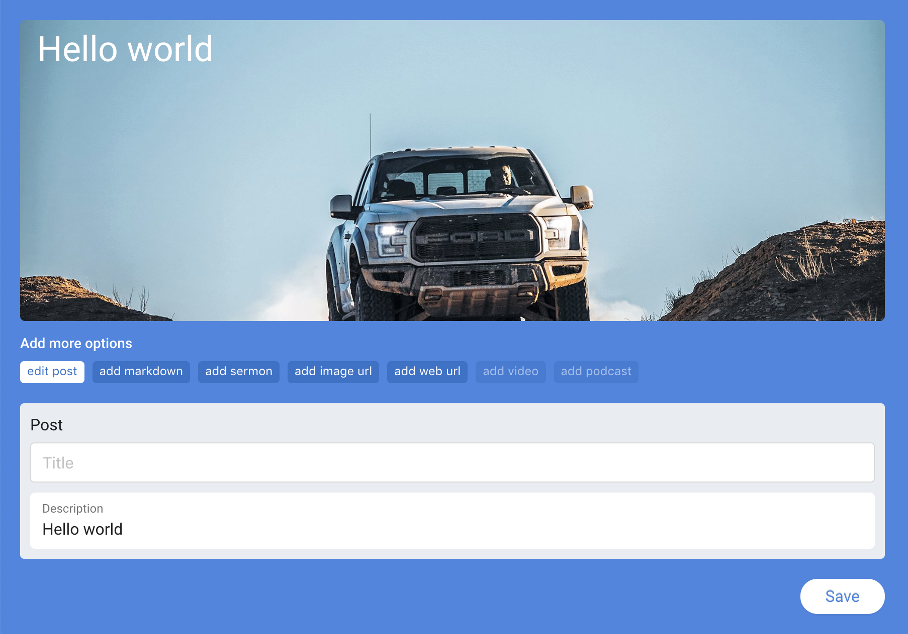

# Fancy post

 <!-- .element height="100%" width="100%" -->

## Motivation
With Facebook, YouTube and more apps giving you the power to publish user driven content like posts and videos, this UI library will help you implement a fancy post component so your users can get excited about publishing their own content through your app.

## Supported React versions
This package requires React 16.6.0 and higher.

## License
### Commercial license
If you want to use Fancy post to develop commercial sites, themes, projects, and applications, the Commercial license is the appropriate license. With this option, your source code is kept proprietary.

### Open source license
If you are creating an open source application under a license compatible with the GNU GPL license v3, you may use Fancy post under the terms of the GPLv3.

## Styles
This library leverages a few different library styles and patterns, such as `Ant Design`, `Material UI`, `SASS` and `BEM (Block Element and Modifier)`.

## Rules
Use Rules in combination with the TypeHere component to show which FormType will be rendered. If user types: `https://tenor.com/search/kitten-gifs hello kittens`, then the FormType will render as `WebUrl`.

## API

### Schema: Content types
Create and use Content types, you can begin by using our out-of-the-box content types:

#### Blurb
`Render only Description field and minimise all other fields as toggle options. Show Image only in preview pane.`

```jsx
fancyPost.contentType({
  type: 'blurb',
  fields: [{
      name: 'title',
      minimise: true,
      validation: {}
    },
    {
      name: 'description',
      show: true,
      validation: {}
    },
		{
      name: 'weburl',
      minimise: true,
      validation: {}
    },
		{
      name: 'image',
      preview: true,
      validation: {}
    },
  ]
});
```

#### Web Url
`Render only Web Url field and minimise all other fields as toggle options. Show Image only in preview pane.`

```jsx
fancyPost.contentType({
  type: 'blurb',
  fields: [{
      name: 'title',
      minimise: true,
      validation: {}
    },
    {
      name: 'description',
      minimise: true,
      validation: {}
    },
		{
      name: 'weburl',
      show: true,
      validation: {}
    },
		{
      name: 'image',
      preview: true,
      validation: {}
    },
  ]
});
```

#### Image
`Render only Image field and minimise all other fields as toggle options. Show Image both as a field and in the preview pane.`

```jsx
fancyPost.contentType({
  type: 'blurb',
  fields: [{
      name: 'title',
      minimise: true,
      validation: {}
    },
    {
      name: 'description',
      minimise: true,
      validation: {}
    },
		{
      name: 'weburl',
      minimise: true,
      validation: {}
    },
		{
      name: 'image',
      show: true,
      preview: true,
      validation: {}
    },
  ]
});
```

### Component: TypeHere
`import {  TypeHere } from '../index.js';`

| Name | Type | Description |
| ------ | ------ | ------ |
| preview | component | Preview component to render TypeHere results |

### Component: Preview
`import {  Preview } from '../index.js';`

| Name | Type | Description |
| ------ | ------ | ------ |
| showResponsive | prop | Show render at width 400px |

### Component: FormType
`import {  FormType } from '../index.js';`

| Name | Type | Description |
| ------ | ------ | ------ |
| default | string | String for content type, such as: blurb, weburl or image |

## Example
```jsx
import React, { Component } from 'react';
import { TypeHere, Preview, FormType } from '../index.js';
import { Wrapper } from './styles/js/styled';
import './styles/scss/styles.scss';

class App extends Component {
  render() {
    return (
      <Wrapper>
        <TypeHere
          preview={Preview}
        />
        <FormType default="blurb" />
      </Wrapper>
    );
  }
}

export default App;
```

By Puff Stream 🚀🐳, 2018